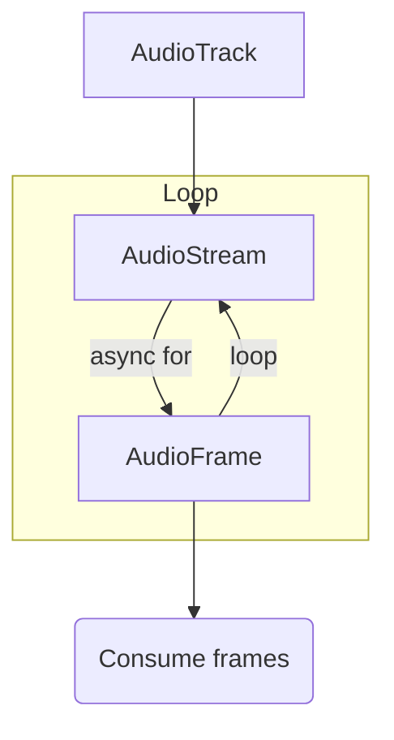
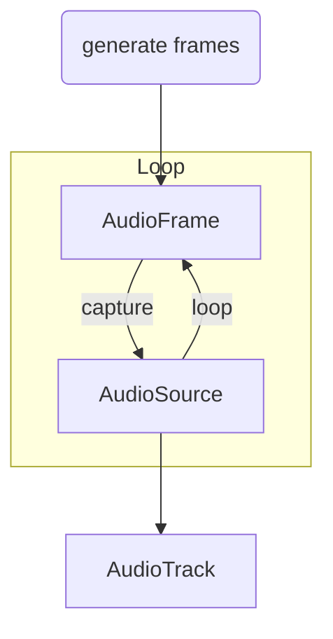

# LiveKit Agents Framework

Version: 1.2.14
Date Curated: 2025-10-08

## Overview
The LiveKit Agents Framework enables building realtime multimodal AI agents in Python.
This framework is used to create programmatic participants that can publish and subscribe to tracks.

## Publishing from backend

You may also publish audio and video tracks from a backend process, which can be consumed just like any camera or microphone track. The [LiveKit Agents](https://docs.livekit.io/agents.md) framework makes it easy to add a programmable participant to any room, and publish media such as synthesized speech or video.

LiveKit also includes complete SDKs for server environments in [Go](https://github.com/livekit/server-sdk-go), [Rust](https://github.com/livekit/rust-sdks), [Python](https://github.com/livekit/python-sdks), and [Node.js](https://github.com/livekit/node-sdks).

You can also publish media using the [LiveKit CLI](https://github.com/livekit/livekit-cli?tab=readme-ov-file#publishing-to-a-room).

### Publishing audio tracks

You can publish audio by creating an `AudioSource` and publishing it as a track.

Audio streams carry raw PCM data at a specified sample rate and channel count. Publishing audio involves splitting the stream into audio frames of a configurable length. An internal buffer holds 50 ms of queued audio to send to the realtime stack. The `capture_frame` method, used to send new frames, is blocking and doesn't return control until the buffer has taken in the entire frame. This allows for easier interruption handling.

In order to publish an audio track, you need to determine the sample rate and number of channels beforehand, as well as the length (number of samples) of each frame. In the following example, the agent transmits a constant 16-bit sine wave at 48kHz in 10 ms long frames:

**Python**:

```python
import numpy as np

from livekit import agents,rtc

SAMPLE_RATE = 48000
NUM_CHANNELS = 1 # mono audio
AMPLITUDE = 2 ** 8 - 1
SAMPLES_PER_CHANNEL = 480 # 10 ms at 48kHz

async def entrypoint(ctx: agents.JobContext):

    source = rtc.AudioSource(SAMPLE_RATE, NUM_CHANNELS)
    track = rtc.LocalAudioTrack.create_audio_track("example-track", source)
    # since the agent is a participant, our audio I/O is its "microphone"
    options = rtc.TrackPublishOptions(source=rtc.TrackSource.SOURCE_MICROPHONE)
    # ctx.agent is an alias for ctx.room.local_participant
    publication = await ctx.agent.publish_track(track, options)

    frequency = 440
    async def _sinewave():
        audio_frame = rtc.AudioFrame.create(SAMPLE_RATE, NUM_CHANNELS, SAMPLES_PER_CHANNEL)
        audio_data = np.frombuffer(audio_frame.data, dtype=np.int16)

        time = np.arange(SAMPLES_PER_CHANNEL) / SAMPLE_RATE
        total_samples = 0
        while True:
            time = (total_samples + np.arange(SAMPLES_PER_CHANNEL)) / SAMPLE_RATE
            sinewave = (AMPLITUDE * np.sin(2 * np.pi * frequency * time)).astype(np.int16)
            np.copyto(audio_data, sinewave)

            # send this frame to the track
            await source.capture_frame(audio_frame)
            total_samples += SAMPLES_PER_CHANNEL

    await _sinewave()

```

> ⚠️ **Warning**
> 
> When streaming finite audio (for example, from a file), make sure the frame length isn't longer than the number of samples left to stream, otherwise the end of the buffer consists of noise.

#### Audio examples

For audio examples using the LiveKit SDK, see the following in the GitHub repository:

- **[Speedup Output Audio](https://github.com/livekit/agents/blob/main/examples/voice_agents/speedup_output_audio.py)**: Use the [TTS node](https://docs.livekit.io/agents/build/nodes.md#tts-node) to speed up audio output.

- **[Echo Agent](https://github.com/livekit/agents/blob/main/examples/primitives/echo-agent.py)**: Echo user audio back to them.

- **[Sync TTS Transcription](https://github.com/livekit/agents/blob/main/examples/other/text-to-speech/sync_tts_transcription.py)**: Uses manual subscription, transcription forwarding, and manually publishes audio output.

### Publishing video tracks

Agents publish data to their tracks as a continuous live feed. Video streams can transmit data in any of [11 buffer encodings](https://github.com/livekit/python-sdks/blob/main/livekit-rtc/livekit/rtc/_proto/video_frame_pb2.pyi#L93). When publishing video tracks, you need to establish the frame rate and buffer encoding of the video beforehand.

In this example, the agent connects to the room and starts publishing a solid color frame at 10 frames per second (FPS). Copy the following code into your `entrypoint` function:

**Python**:

```python
from livekit import rtc
from livekit.agents import JobContext

WIDTH = 640
HEIGHT = 480

source = rtc.VideoSource(WIDTH, HEIGHT)
track = rtc.LocalVideoTrack.create_video_track("example-track", source)
options = rtc.TrackPublishOptions(
    # since the agent is a participant, our video I/O is its "camera"
    source=rtc.TrackSource.SOURCE_CAMERA,
    simulcast=True,
    # when modifying encoding options, max_framerate and max_bitrate must both be set
    video_encoding=rtc.VideoEncoding(
        max_framerate=30,
        max_bitrate=3_000_000,
    ),
    video_codec=rtc.VideoCodec.H264,
)
publication = await ctx.agent.publish_track(track, options)

# this color is encoded as ARGB. when passed to VideoFrame it gets re-encoded.
COLOR = [255, 255, 0, 0]; # FFFF0000 RED

async def _draw_color():
    argb_frame = bytearray(WIDTH * HEIGHT * 4)
    while True:
        await asyncio.sleep(0.1) # 10 fps
        argb_frame[:] = COLOR * WIDTH * HEIGHT
        frame = rtc.VideoFrame(WIDTH, HEIGHT, rtc.VideoBufferType.RGBA, argb_frame)

        # send this frame to the track
        source.capture_frame(frame)

asyncio.create_task(_draw_color())

```

> ℹ️ **Note**
> 
> - Although the published frame is static, it's still necessary to stream it continuously for the benefit of participants joining the room after the initial frame is sent.
> - Unlike audio, video `capture_frame` doesn't keep an internal buffer.

LiveKit can translate between video buffer encodings automatically. `VideoFrame` provides the current video buffer type and a method to convert it to any of the other encodings:

**Python**:

```python

async def handle_video(track: rtc.Track):
    video_stream = rtc.VideoStream(track)
    async for event in video_stream:
        video_frame = event.frame
        current_type = video_frame.type
        frame_as_bgra = video_frame.convert(rtc.VideoBufferType.BGRA)
        # [...]
    await video_stream.aclose()

@ctx.room.on("track_subscribed")
def on_track_subscribed(
    track: rtc.Track,
    publication: rtc.TrackPublication,
    participant: rtc.RemoteParticipant,
):
    if track.kind == rtc.TrackKind.KIND_VIDEO:
        asyncio.create_task(handle_video(track))

```

### Audio and video synchronization

> ℹ️ **Note**
> 
> `AVSynchronizer` is currently only available in Python.

While WebRTC handles A/V sync natively, some scenarios require manual synchronization - for example, when synchronizing generated video with voice output.

The [`AVSynchronizer`](https://docs.livekit.io/reference/python/v1/livekit/rtc/index.html.md#livekit.rtc.AVSynchronizer) utility helps maintain synchronization by aligning the first audio and video frames. Subsequent frames are automatically synchronized based on configured video FPS and audio sample rate.

- **[Audio and video synchronization](https://github.com/livekit/python-sdks/tree/main/examples/video-stream)**: Examples that demonstrate how to synchronize video and audio streams using the `AVSynchronizer` utility.

---

---

## Screen sharing

## Overview

LiveKit supports screen sharing natively across all platforms. Your screen is published as a video track, just like your camera. Some platforms support local audio sharing as well.

The steps are somewhat different for each platform:

**JavaScript**:

```typescript
// The browser will prompt the user for access and offer a choice of screen, window, or tab 
await room.localParticipant.setScreenShareEnabled(true);

```

---

**Swift**:

On iOS, LiveKit integrates with ReplayKit in two modes:

1. **In-app capture (default)**: For sharing content within your app
2. **Broadcast capture**: For sharing screen content even when users switch to other apps

#### In-app capture

The default in-app capture mode requires no additional configuration, but shares only the current application.

```swift
localParticipant.setScreenShare(enabled: true)

```

#### Broadcast capture

To share the full screen while your app is running in the background, you'll need to set up a Broadcast Extension. This will allow the user to "Start Broadcast". You can prompt this from your app or the user can start it from the control center.

The full steps are described in our [iOS screen sharing guide](https://github.com/livekit/client-sdk-swift/blob/main/Docs/ios-screen-sharing.md), but a summary is included below:

1. Add a new "Broadcast Upload Extension" target with the bundle identifier `<your-app-bundle-identifier>.broadcast`.
2. Replace the default `SampleHandler.swift` with the following:

```swift
import LiveKit

#if os(iOS)
@available(macCatalyst 13.1, *)
class SampleHandler: LKSampleHandler {
    override var enableLogging: Bool { true }
}
#endif

```

1. Add both your main app and broadcast extension to a common App Group, named `group.<your-app-bundle-identifier>`.
2. Present the broadcast dialog from your app:

```swift
localParticipant.setScreenShare(enabled: true)

```

---

**Android**:

On Android, screen capture is performed using `MediaProjectionManager`:

```kotlin
// Create an intent launcher for screen capture
// This *must* be registered prior to onCreate(), ideally as an instance val
val screenCaptureIntentLauncher = registerForActivityResult(
    ActivityResultContracts.StartActivityForResult()
) { result ->
    val resultCode = result.resultCode
    val data = result.data
    if (resultCode != Activity.RESULT_OK || data == null) {
        return@registerForActivityResult
    }
    lifecycleScope.launch {
        room.localParticipant.setScreenShareEnabled(true, data)
    }
}

// When it's time to enable the screen share, perform the following
val mediaProjectionManager =
    getSystemService(MEDIA_PROJECTION_SERVICE) as MediaProjectionManager
screenCaptureIntentLauncher.launch(mediaProjectionManager.createScreenCaptureIntent())

```

---

**Flutter**:

```dart
room.localParticipant.setScreenShareEnabled(true);

```

On Android, you would have to define a foreground service in your AndroidManifest.xml:

```xml
<manifest xmlns:android="http://schemas.android.com/apk/res/android">
  <application>
    ...
    <service
        android:name="de.julianassmann.flutter_background.IsolateHolderService"
        android:enabled="true"
        android:exported="false"
        android:foregroundServiceType="mediaProjection" />
  </application>
</manifest>

```

On iOS, follow [this guide](https://github.com/flutter-webrtc/flutter-webrtc/wiki/iOS-Screen-Sharing#broadcast-extension-quick-setup) to set up a Broadcast Extension.

---

**Unity (WebGL)**:

```csharp
yield return currentRoom.LocalParticipant.SetScreenShareEnabled(true);

```

## Sharing browser audio

> ℹ️ **Note**
> 
> Audio sharing is only possible in certain browsers. Check browser support on the [MDN compatibility table](https://developer.mozilla.org/en-US/docs/Web/API/Screen_Capture_API/Using_Screen_Capture#browser_compatibility).

To share audio from a browser tab, you can use the `createScreenTracks` method with the audio option enabled:

```js
const tracks = await localParticipant.createScreenTracks({
  audio: true,
});

tracks.forEach((track) => {
  localParticipant.publishTrack(track);
});

```

### Testing audio sharing

#### Publisher

When sharing audio, make sure you select a **Browser Tab** (not a Window) and ☑️ Share tab audio, otherwise no audio track will be generated when calling `createScreenTracks`:


#### Subscriber

On the receiving side, you can use [`RoomAudioRenderer`](https://github.com/livekit/components-js/blob/main/packages/react/src/components/RoomAudioRenderer.tsx) to play all audio tracks of the room automatically, [`AudioTrack`](https://github.com/livekit/components-js/blob/main/packages/react/src/components/participant/AudioTrack.tsx) or your own custom `<audio>` tag to add the track to the page. If you don't hear any sound, check you're receiving the track from the server:

**JavaScript**:

```javascript
room.getParticipantByIdentity('<participant_id>').getTrackPublication('screen_share_audio');

```

---

---

## Subscribing to tracks

## Overview

While connected to a room, a participant can receive and render any tracks published to the room. When `autoSubscribe` is enabled (default), the server automatically delivers new tracks to participants, making them ready for rendering.

## Track subscription

Rendering media tracks starts with a subscription to receive the track data from the server.

As mentioned in the guide on [rooms, participants, and tracks](https://docs.livekit.io/home/get-started/api-primitives.md), LiveKit models tracks with two constructs: `TrackPublication` and `Track`. Think of a `TrackPublication` as metadata for a track registered with the server and `Track` as the raw media stream. Track publications are always available to the client, even when the track is not subscribed to.

Track subscription callbacks provide your app with both the `Track` and `TrackPublication` objects.

Subscribed callback will be fired on both `Room` and `RemoteParticipant` objects.

**JavaScript**:

```typescript
import { connect, RoomEvent } from 'livekit-client';

room.on(RoomEvent.TrackSubscribed, handleTrackSubscribed);

function handleTrackSubscribed(
  track: RemoteTrack,
  publication: RemoteTrackPublication,
  participant: RemoteParticipant,
) {
  /* Do things with track, publication or participant */
}

```

---

**React**:

```typescript
import { useTracks } from '@livekit/components-react';

export const MyPage = () => {
  return (
    <LiveKitRoom ...>
      <MyComponent />
    </LiveKitRoom>
  )
}

export const MyComponent = () => {
  const cameraTracks = useTracks([Track.Source.Camera], {onlySubscribed: true});
  return (
    <>
      {cameraTracks.map((trackReference) => {
        return (
          <VideoTrack {...trackReference} />
        )
      })}
    </>
  )
}

```

---

**Swift**:

```swift
  let room = LiveKit.connect(options: ConnectOptions(url: url, token: token), delegate: self)
  ...
  func room(_ room: Room,
            participant: RemoteParticipant,
            didSubscribe publication: RemoteTrackPublication,
            track: Track) {

    /* Do things with track, publication or participant */
  }

```

---

**Android**:

```kotlin
coroutineScope.launch {
  room.events.collect { event ->
    when(event) {
      is RoomEvent.TrackSubscribed -> {
        /* Do things with track, publication or participant */
      }
      else -> {}
    }
  }
}

```

---

**Flutter**:

```dart
class ParticipantWidget extends StatefulWidget {
  final Participant participant;

  ParticipantWidget(this.participant);

  @override
  State<StatefulWidget> createState() {
    return _ParticipantState();
  }
}

class _ParticipantState extends State<ParticipantWidget> {
  TrackPublication? videoPub;

  @override
  void initState() {
    super.initState();
    // When track subscriptions change, Participant notifies listeners
    // Uses the built-in ChangeNotifier API
    widget.participant.addListener(_onChange);
  }

  @override
  void dispose() {
    super.dispose();
    widget.participant.removeListener(_onChange);
  }

  void _onChange() {
    TrackPublication? pub;
    var visibleVideos = widget.participant.videoTracks.values.where((pub) {
      return pub.kind == TrackType.VIDEO && pub.subscribed && !pub.muted;
    });
    if (visibleVideos.isNotEmpty) {
      pub = visibleVideos.first;
    }
    // setState will trigger a build
    setState(() {
      // Your updates here
      videoPub = pub;
    });
  }

  @override
  Widget build(BuildContext context) {
    // Your build function
  }
}

```

---

**Python**:

```python
@room.on("track_subscribed")
def on_track_subscribed(track: rtc.Track, publication: rtc.RemoteTrackPublication, participant: rtc.RemoteParticipant):
    if track.kind == rtc.TrackKind.KIND_VIDEO:
        video_stream = rtc.VideoStream(track)
        async for frame in video_stream:
            # Received a video frame from the track, process it here
            pass
        await video_stream.aclose()

```

---

**Rust**:

```rust
while let Some(msg) = rx.recv().await {
    #[allow(clippy::single_match)]
    match msg {
        RoomEvent::TrackSubscribed {
            track,
            publication: _,
            participant: _,
        } => {
            if let RemoteTrack::Audio(audio_track) = track {
                let rtc_track = audio_track.rtc_track();
                let mut audio_stream = NativeAudioStream::new(rtc_track);
                while let Some(frame) = audio_stream.next().await {
                    // do something with audio frame
                }
                break;
            }
        }
        _ => {}
    }
}

```

---

**Unity**:

```csharp
Room.TrackSubscribed += (track, publication, participant) =>
{
    // Do things with track, publication or participant
};

```

> ℹ️ **Note**
> 
> This guide is focused on frontend applications. To consume media in your backend, use the [LiveKit Agents framework](https://docs.livekit.io/agents.md) or SDKs for [Go](https://github.com/livekit/server-sdk-go), [Rust](https://github.com/livekit/rust-sdks), [Python](https://github.com/livekit/python-sdks), or [Node.js](https://github.com/livekit/node-sdks).

## Media playback

Once subscribed to an audio or video track, it's ready to be played in your application

**JavaScript**:

```typescript
function handleTrackSubscribed(
  track: RemoteTrack,
  publication: RemoteTrackPublication,
  participant: RemoteParticipant,
) {
  // Attach track to a new HTMLVideoElement or HTMLAudioElement
  const element = track.attach();
  parentElement.appendChild(element);
  // Or attach to existing element
  // track.attach(element)
}

```

---

**React**:

```tsx
export const MyComponent = ({ audioTrack, videoTrack }) => {
  return (
    <div>
      <VideoTrack trackRef={videoTrack} />
      <AudioTrack trackRef={audioTrack} />
    </div>
  );
};

```

---

**React Native**:

Audio playback will begin automatically after track subscription. Video playback requires the `VideoTrack` component:

```tsx
export const MyComponent = ({ videoTrack }) => {
  return <VideoTrack trackRef={videoTrack} />;
};

```

---

**Swift**:

Audio playback begins automatically after track subscription. Video playback requires the `VideoView` component:

```swift
func room(_ room: Room,
          participant: RemoteParticipant,
          didSubscribe publication: RemoteTrackPublication,
          track: Track) {

  // Audio tracks are automatically played.
  if let videoTrack = track as? VideoTrack {
    DispatchQueue.main.async {
      // VideoView is compatible with both iOS and MacOS
      let videoView = VideoView(frame: .zero)
      videoView.translatesAutoresizingMaskIntoConstraints = false
      self.view.addSubview(videoView)

      /* Add any app-specific layout constraints */

      videoView.track = videoTrack
    }
  }
}

```

---

**Android**:

Audio playback will begin automatically after track subscription. Video playback requires the `VideoTrack` component:

```kotlin
coroutineScope.launch {
  room.events.collect { event ->
    when(event) {
      is RoomEvent.TrackSubscribed -> {
        // Audio tracks are automatically played.
        val videoTrack = event.track as? VideoTrack ?: return@collect
        videoTrack.addRenderer(videoRenderer)
      }
      else -> {}
    }
  }
}

```

---

**Flutter**:

Audio playback will begin automatically after track subscription. Video playback requires the `VideoTrackRenderer` component:

```dart
class _ParticipantState extends State<ParticipantWidget> {
  TrackPublication? videoPub;
  ...
  @override
  Widget build(BuildContext context) {
    // Audio tracks are automatically played.
    var videoPub = this.videoPub;
    if (videoPub != null) {
      return VideoTrackRenderer(videoPub.track as VideoTrack);
    } else {
      return Container(
        color: Colors.grey,
      );
    }
  }
}

```

---

**Unity (WebGL)**:

Audio playback will begin automatically after track subscription. Video playback requires an `HTMLVideoElement`:

```csharp
Room.TrackSubscribed += (track, publication, participant) =>
{
    var element = track.Attach();

    if (element is HTMLVideoElement video)
    {
        video.VideoReceived += tex =>
        {
            // Do things with tex
        };
    }
};

```

### Volume control

Audio tracks support a volume between 0 and 1.0, with a default value of 1.0. You can adjust the volume if necessary be setting the volume property on the track.

**JavaScript**:

```typescript
track.setVolume(0.5);

```

---

**Swift**:

```swift
track.volume = 0.5

```

---

**Android**:

```kotlin
track.setVolume(0.5)

```

---

**Flutter**:

```dart
track.setVolume(0.5)

```

## Active speaker identification

LiveKit can automatically detect participants who are actively speaking and send updates when their speaking status changes. Speaker updates are sent for both local and remote participants. These events fire on both Room and Participant objects, allowing you to identify active speakers in your UI.

**JavaScript**:

```typescript
room.on(RoomEvent.ActiveSpeakersChanged, (speakers: Participant[]) => {
  // Speakers contain all of the current active speakers
});

participant.on(ParticipantEvent.IsSpeakingChanged, (speaking: boolean) => {
  console.log(
    `${participant.identity} is ${speaking ? 'now' : 'no longer'} speaking. audio level: ${participant.audioLevel}`,
  );
});

```

---

**React**:

```tsx
export const MyComponent = ({ participant }) => {
  const { isSpeaking } = useParticipant(participant);

  return <div>{isSpeaking ? 'speaking' : 'not speaking'}</div>;
};

```

---

**React Native**:

```tsx
export const MyComponent = ({ participant }) => {
  const { isSpeaking } = useParticipant(participant);

  return <Text>{isSpeaking ? 'speaking' : 'not speaking'}</Text>;
};

```

---

**Swift**:

```swift
extension MyRoomHandler : RoomDelegate {
  func didUpdateSpeakingParticipants(speakers: [Participant], room _: Room) {
    // Do something with the active speakers
  }
}

extension ParticipantHandler : ParticipantDelegate {
  /// The isSpeaking status of the participant has changed
  func didUpdateIsSpeaking(participant: Participant) {
    print("\(participant.identity) is now speaking: \(participant.isSpeaking), audioLevel: \(participant.audioLevel)")
  }
}

```

---

**Android**:

```kotlin
coroutineScope.launch {
  room::activeSpeakers.flow.collect { currentActiveSpeakers ->
    // Manage speaker changes across the room
  }
}

coroutineScope.launch {
  remoteParticipant::isSpeaking.flow.collect { isSpeaking ->
    // Handle a certain participant speaker status change
  }
}

```

---

**Flutter**:

```dart
class _ParticipantState extends State<ParticipantWidget> {
  late final _listener = widget.participant.createListener()

  @override
  void initState() {
    super.initState();
    _listener.on<SpeakingChangedEvent>((e) {
      // Handle isSpeaking change
    })
  }
}

```

---

**Unity (WebGL)**:

```csharp
Room.ActiveSpeakersChanged += speakers =>
{
    // Do something with the active speakers
};

participant.IsSpeakingChanged += speaking =>
{
    Debug.Log($"{participant.Identity} is {(speaking ? "now" : "no longer")} speaking. Audio level {participant.AudioLevel}");
};

```

## Selective subscription

Disable `autoSubscribe` to take manual control over which tracks the participant should subscribe to. This is appropriate for spatial applications and/or applications that require precise control over what each participant receives.

Both LiveKit's SDKs and server APIs have controls for selective subscription. Once configured, only explicitly subscribed tracks are delivered to the participant.

### From frontend

**JavaScript**:

```typescript
let room = await room.connect(url, token, {
  autoSubscribe: false,
});

room.on(RoomEvent.TrackPublished, (publication, participant) => {
  publication.setSubscribed(true);
});

// Also subscribe to tracks published before participant joined
room.remoteParticipants.forEach((participant) => {
  participant.trackPublications.forEach((publication) => {
    publication.setSubscribed(true);
  });
});

```

---

**Swift**:

```swift
let connectOptions = ConnectOptions(
  url: "ws://<your_host>",
  token: "<your_token>",
  autoSubscribe: false
)
let room = LiveKit.connect(options: connectOptions, delegate: self)

func didPublishRemoteTrack(publication: RemoteTrackPublication, participant: RemoteParticipant) {
    publication.set(subscribed: true)
}

// Also subscribe to tracks published before participant joined
for participant in roomCtx.room.room.remoteParticipants {
    for publication in participant.tracks {
        publication.set(subscribed: true)
    }
}

```

---

**Android**:

```kotlin
class ViewModel(...) {
  suspend fun connect() {
    val room = LiveKit.create(appContext = application)
    room.connect(
        url = url,
        token = token,
        options = ConnectOptions(autoSubscribe = false)
    )

    // Also subscribe to tracks published before participant joined
    for (participant in room.remoteParticipants.values) {
      for (publication in participant.trackPublications.values) {
        val remotePub = publication as RemoteTrackPublication
        remotePub.setSubscribed(true)
      }
    }
    viewModelScope.launch {
      room.events.collect { event ->
        if(event is RoomEvent.TrackPublished) {
          val remotePub = event.publication as RemoteTrackPublication
          remotePub.setSubscribed(true)
        }
      }
    }
  }
}

```

---

**Flutter**:

```dart
const roomOptions = RoomOptions(
      adaptiveStream: true,
      dynacast: true);
const connectOptions = ConnectOptions(
      autoSubscribe: false);

final room = Room();
await room.connect(url, token, connectOptions: connectOptions, roomOptions: roomOptions);
// If necessary, we can listen to room events here
final listener = room.createListener();

class RoomHandler {
  Room room;
  late EventsListener<RoomEvent> _listener;

  RoomHandler(this.room) {
    _listener = room.createListener();
    _listener.on<TrackPublishedEvent>((e) {
      unawaited(e.publication.subscribe());
    });

    // Also subscribe to tracks published before participant joined
    for (RemoteParticipant participant in room.remoteParticipants.values) {
      for (RemoteTrackPublication publication
          in participant.trackPublications.values) {
        unawaited(publication.subscribe());
      }
    }
  }
}

```

---

**Python**:

```python
@room.on("track_published")
    def on_track_published(
        publication: rtc.RemoteTrackPublication, participant: rtc.RemoteParticipant
    ):
        publication.set_subscribed(True)

await room.connect(url, token, rtc.RoomOptions(auto_subscribe=False))

# Also subscribe to tracks published before participant joined
for p in room.remote_participants.values():
  for pub in p.track_publications.values():
    pub.set_subscribed(True)

```

---

**Unity (WebGL)**:

```csharp
yield return room.Connect(url, token, new RoomConnectOptions()
{
    AutoSubscribe = false
});

room.TrackPublished += (publication, participant) =>
{
    publication.SetSubscribed(true);
};

```

### From server API

These controls are also available with the server APIs.

**Node.js**:

```typescript
import { RoomServiceClient } from 'livekit-server-sdk';

const roomServiceClient = new RoomServiceClient('myhost', 'api-key', 'my secret');

// Subscribe to new track
roomServiceClient.updateSubscriptions('myroom', 'receiving-participant-identity', ['TR_TRACKID'], true);

// Unsubscribe from existing track
roomServiceClient.updateSubscriptions('myroom', 'receiving-participant-identity', ['TR_TRACKID'], false);

```

---

**Go**:

```go
import (
  lksdk "github.com/livekit/server-sdk-go"
)

roomServiceClient := lksdk.NewRoomServiceClient(host, apiKey, apiSecret)
_, err := roomServiceClient.UpdateSubscriptions(context.Background(), &livekit.UpdateSubscriptionsRequest{
  Room: "myroom",
  Identity: "receiving-participant-identity",
  TrackSids: []string{"TR_TRACKID"},
  Subscribe: true
})

```

## Adaptive stream

In an application, video elements where tracks are rendered could vary in size, and sometimes hidden. It would be extremely wasteful to fetch high-resolution videos but only to render it in a 150x150 box.

Adaptive stream allows a developer to build dynamic video applications without consternation for how interface design or user interaction might impact video quality. It allows us to fetch the minimum bits necessary for high-quality rendering and helps with scaling to very large sessions.

When adaptive stream is enabled, the LiveKit SDK will monitor both size and visibility of the UI elements that the tracks are attached to. Then it'll automatically coordinate with the server to ensure the closest-matching simulcast layer that matches the UI element is sent back. If the element is hidden, the SDK will automatically pause the associated track on the server side until the element becomes visible.

> ℹ️ **Note**
> 
> With JS SDK, you must use `Track.attach()` in order for adaptive stream to be effective.


## Enabling/disabling tracks

Implementations seeking fine-grained control can enable or disable tracks at their discretion. This could be used to implement subscriber-side mute. (for example, muting a publisher in the room, but only for the current user).

When disabled, the participant will not receive any new data for that track. If a disabled track is subsequently enabled, new data will be received again.

The `disable` action is useful when optimizing for a participant's bandwidth consumption. For example, if a particular user's video track is offscreen, disabling this track will reduce bytes from being sent by the LiveKit server until the track's data is needed again. (this is not needed with adaptive stream)

**JavaScript**:

```typescript
import { connect, RoomEvent } from 'livekit-client';

room.on(RoomEvent.TrackSubscribed, handleTrackSubscribed);

function handleTrackSubscribed(
  track: RemoteTrack,
  publication: RemoteTrackPublication,
  participant: RemoteParticipant,
) {
  publication.setEnabled(false);
}

```

---

**Swift**:

```swift
let room = LiveKit.connect(options: ConnectOptions(url: url, token: token), delegate: self)
...
func room(_ room: Room,
          participant: RemoteParticipant,
          didSubscribe publication: RemoteTrackPublication,
          track: Track) {

  publication.setEnabled(false)
}

```

---

**Android**:

```kotlin
coroutineScope.launch {
  room.events.collect { event ->
    when(event) {
      is RoomEvent.TrackSubscribed -> {
        event.publication.setEnabled(false)
      }
      else -> {}
    }
  }
}

```

---

**Flutter**:

```dart
void disableTrack(RemoteTrackPublication publication) {
  publication.enabled = false;
}

```

---

**Unity (WebGL)**:

```csharp
room.TrackSubscribed += (track, publication, participant) =>
{
    publication.SetEnabled(false);
};

```

> ℹ️ **Note**
> 
> You may be wondering how `subscribe` and `unsubscribe` differs from `enable` and `disable`. A track must be subscribed to and enabled for data to be received by the participant. If a track has not been subscribed to (or was unsubscribed) or disabled, the participant performing these actions will not receive that track's data.
> 
> The difference between these two actions is _negotiation_. Subscribing requires a negotiation handshake with the LiveKit server, while enable/disable does not. Depending on one's use case, this can make enable/disable more efficient, especially when a track may be turned on or off frequently.

## Simulcast controls

If a video track has simulcast enabled, a receiving participant may want to manually specify the maximum receivable quality. This would result a quality and bandwidth reduction for the target track. This might come in handy, for instance, when an application's user interface is displaying a small thumbnail for a particular user's video track.

**JavaScript**:

```typescript
import { connect, RoomEvent } from 'livekit-client';

connect('ws://your_host', token, {
  audio: true,
  video: true,
}).then((room) => {
  room.on(RoomEvent.TrackSubscribed, handleTrackSubscribed);
});

function handleTrackSubscribed(
  track: RemoteTrack,
  publication: RemoteTrackPublication,
  participant: RemoteParticipant,
) {
  if (track.kind === Track.Kind.Video) {
    publication.setVideoQuality(VideoQuality.LOW);
  }
}

```

---

**Swift**:

```swift
let room = LiveKit.connect(url, token, delegate: self)
...
func room(_ room: Room,
          participant: RemoteParticipant,
          didSubscribe publication: RemoteTrackPublication,
          track: Track) {

  if let _ = track as? VideoTrack {
    publication.setVideoQuality(.low)
  }
}

```

---

**Android**:

```kotlin
coroutineScope.launch {
  room.events.collect { event ->
    when(event) {
      is RoomEvent.TrackSubscribed -> {
        event.publication.setVideoQuality(VideoQuality.LOW)
      }
      else -> {}
    }
  }
}

```

---

**Flutter**:

```dart
var listener = room.createListener();
listener.on<TrackSubscribedEvent>((e) {
  if (e.publication.kind == TrackType.VIDEO) {
    e.publication.videoQuality = VideoQuality.LOW;
  }
})

```

---

**Unity (WebGL)**:

```csharp
room.TrackSubscribed += (track, publication, participant) =>
{
    if(publication.Kind == TrackKind.Video)
        publication.SetVideoQuality(VideoQuality.LOW);
};

```

---

---

## Processing raw tracks

## Overview

LiveKit's [server-side SDKs](https://docs.livekit.io/home/client.md#server-side-sdks) give you full control over how media is processed and published. You can work directly with participant tracks or media files to apply custom processing.

A typical media-processing workflow involves three steps:

1. Iterate over frames from a stream or file.
2. Apply processing logic to each frame.
3. Publish or save the processed output.

## Subscribing to participant tracks

When you subscribe to participant tracks, the SDK handles frame segmentation automatically. You can construct an `AudioStream` or `VideoStream` from any participant track. The media streams are asynchronous iterators that deliver individual audio or video frames. You can process these frames and either publish them back to the room or save them.

The diagram below shows the process of subscribing to a participant track. The same applies to video.



For example, iterate through an audio stream:

```python
stream = rtc.AudioStream(track, sample_rate=SAMPLE_RATE, num_channels=NUM_CHANNELS)
async for frame_event in stream:
   frame = frame_event.frame
   # ... do something with frame.data ...

```

The following example demonstrates how iterate through audio frames from a participant track and publish them back to the room. The same principles apply to video tracks.

- **[Local audio device example](https://github.com/livekit-examples/local-audio-python)**: Python app that demonstrates how to publish microphone audio, and receive and play back audio from other participants.

## Publishing local audio files

When reading a local audio file, you must manually handle chunking and resampling before processing or output. For audio files, determine the number of channels and sample rate; this information is required to produce correct output audio. Split the audio into fixed-size chunks (WebRTC commonly uses 20 ms chunks) and create an audio frame for each chunk.

The input and output sample rates must match to ensure correct playback speed and fidelity. When subscribing to a participant track, LiveKit automatically handles any required resampling. However, when reading from a local file, you are responsible for resampling if needed.

See the following for a detailed example.

- **[Read and write audio files](https://github.com/livekit-examples/noise-canceller)**: This tool allows you to read a local audio file, process it with noise filtering, and save the output to a local file.

## Publishing media

Publishing audio or video to a room requires creating a local track and an audio or video source. For audio, push audio frames to the `AudioSource`. The `LocalAudioTrack` object is used to publish the audio source as a track. All subscribed participants hear the published track

For example, publish audio from a microphone:

```python
self.source = rtc.AudioSource(SAMPLE_RATE, NUM_CHANNELS)
track = rtc.LocalAudioTrack.create_audio_track("mic", source)
options = rtc.TrackPublishOptions()
options.source = rtc.TrackSource.SOURCE_MICROPHONE
publication = await room.local_participant.publish_track(track, options)

```

The diagram below shows the process of publishing audio to a room. The same applies to video.



### Saving media to a file

You can save audio or video to a file by pushing frames to an array and then writing the array to a file. For example, to create a `WAV` file from an audio stream, you can use the following code:

```python
import wave

output_file = "output.wav"

# Create a list to store processed audio frames
processed_frames = []

# Push audio frames to the list
async for audio_event in stream:
    processed_frames.append(audio_event.frame)

# Write the audio frames to the file
with wave.open(output_file, "wb") as wav_file:
    wav_file.setnchannels(CHANNELS)
    wav_file.setsampwidth(2)  # 16-bit
    wav_file.setframerate(SAMPLERATE)
    
    for frame_data in processed_frames:
        wav_file.writeframes(frame_data)

```

## Process media with the Agents Framework

You can build and dispatch a programmatic participant with the Agents Framework. You can use the framework to create the following:

- An AI agent that can be automatically or explicitly dispatched to rooms.
- A programmatic participant that's automatically dispatched to rooms.

Use the Agents Framework [`entrypoint`](https://docs.livekit.io/agents/worker/job.md#entrypoint) function for your audio processing logic.

To learn more, see the following links.

- **[Agents Framework](https://docs.livekit.io/agents.md)**: Build voice AI agents and programmatic participants to process and publish media from the backend.

- **[Echo Agent](https://github.com/livekit/agents/blob/main/examples/primitives/echo-agent.py)**: An example that uses the `entrypoint` function to echo back audio from a participant track.

---

---

## Noise & echo cancellation

## Overview

Your user's microphone is likely to pick up undesirable audio including background noise (like traffic, music, voices, etc) and might also pick up echoes from their own speakers. In both cases, this noise leads to a poor experience for other participants in a call. In voice AI apps, this can also interfere with turn detection or degrade the quality of transcriptions, both of which are critical to a good user experience.

LiveKit includes default outbound noise and echo cancellation based on the underlying open source WebRTC implementations of [`echoCancellation`](https://developer.mozilla.org/en-US/docs/Web/API/MediaTrackSettings/echoCancellation) and [`noiseSuppression`](https://developer.mozilla.org/en-US/docs/Web/API/MediaTrackSettings/noiseSuppression). You can adjust these settings with the `AudioCaptureOptions` type in the LiveKit SDKs during connection.

LiveKit Cloud includes [enhanced noise cancellation](https://docs.livekit.io/home/cloud/noise-cancellation.md) for the best possible audio quality, including a background voice cancellation (BVC) model that is optimized for voice AI applications.

To hear the effects of the various noise removal options, play the samples below:

---

---

## End-to-end encryption

## Overview

LiveKit includes built-in support for end-to-end encryption (E2EE) on realtime audio and video tracks. With E2EE enabled, media data remains fully encrypted from sender to receiver, ensuring that no intermediaries (including LiveKit servers) can access or modify the content. This feature is:

- Available for both self-hosted and LiveKit Cloud customers at no additional cost.
- Ideal for regulated industries and security-critical applications.
- Designed to provide an additional layer of protection beyond standard transport encryption.

> ℹ️ **Security**
> 
> Security is our highest priority. Learn more about [our comprehensive approach to security](https://livekit.io/security).

## How E2EE works

E2EE is enabled at the room level and automatically applied to all media tracks from all participants in that room. You must enable it within the LiveKit SDK for each participant. In many cases you can use a built-in key provider with a single shared key for the whole room. If you require unique keys for each participant, or key rotation during the lifetime of a single room, you can implement your own key provider.

## Key distribution

It is your responsibility to securely generate, store, and distribute encryption keys to your application at runtime. LiveKit does not (and cannot) store or transport encryption keys for you.

If using a shared key, you would typically generate it on your server at the same time that you create a room and distribute it securely to participants alongside their access token for the room. When using unique keys per participant, you may need a more sophisticated method for distributing keys as new participants join the room. Remember that the key is needed for both encryption and decryption, so even when using per-participant keys, you must ensure that all participants have all keys.

## Limitations

All LiveKit network traffic is encrypted using TLS, but full end-to-end encryption applies only to media tracks and is not applied to realtime data, text, API calls, or other signaling.

## Implementation guide

These examples show how to use the built-in key provider with a shared key. If you need to use a custom key provider, see the section below.

**JavaScript**:

```typescript
// 1. Initialize the external key provider
const keyProvider = new ExternalE2EEKeyProvider();

// 2. Configure room options
const roomOptions: RoomOptions = {
  e2ee: {
    keyProvider: keyProvider,
    // Required for web implementations
    worker: new Worker(new URL('livekit-client/e2ee-worker', import.meta.url)),
  },
};

// 3. Create and configure the room
const room = new Room(roomOptions);

// 4. Set your externally distributed encryption key
await keyProvider.setKey(yourSecureKey);

// 5. Enable E2EE for all local tracks
await room.setE2EEEnabled(true);

// 6. Connect to the room
await room.connect(url, token);

```

#### Example implementation

For a production-ready implementation, refer to our [Meet example app](https://github.com/livekit-examples/meet) which demonstrates E2EE in a production-grade application using the `ExternalE2EEKeyProvider`.

---

**iOS**:

```swift
// 1. Initialize the key provider with options
let keyProvider = BaseKeyProvider(isSharedKey: true, sharedKey: "yourSecureKey")

// 2. Configure room options with E2EE
let roomOptions = RoomOptions(e2eeOptions: E2EEOptions(keyProvider: keyProvider))

// 3. Create the room
let room = Room(roomOptions: roomOptions)

// 4. Connect to the room
try await room.connect(url: url, token: token)

```

---

**Android**:

```kotlin
// 1. Initialize the key provider
val keyProvider = BaseKeyProvider()

// 2. Configure room options
val roomOptions = RoomOptions(
    e2eeOptions = E2EEOptions(
        keyProvider = keyProvider
    )
)
// 3. Create and configure the room
val room = LiveKit.create(context, options = roomOptions)

// 4. Set your externally distributed encryption key
keyProvider.setSharedKey(yourSecureKey)

// 5. Connect to the room
room.connect(url, token)

```

#### Example implementation

Our main [Android sample app](https://github.com/livekit/client-sdk-android/tree/main/sample-app) includes an example implementation of E2EE using the built-in key provider.

---

**Flutter**:

```dart
// 1. Initialize the key provider
final keyProvider = await BaseKeyProvider.create();

// 2. Configure room options
final roomOptions = RoomOptions(
  e2eeOptions: E2EEOptions(
    keyProvider: keyProvider,
  ),
);

// 3. Create and configure the room
final room = Room(options: roomOptions);

// 4. Set your externally distributed encryption key
await keyProvider.setSharedKey(yourSecureKey);

// 5. Connect to the room
await room.connect(url, token);

```

#### Example implementation

The Flutter SDK includes a [complete multi-platform example implementation](https://github.com/livekit/client-sdk-flutter/tree/main/example) with E2EE support using a shared key.

---

**React Native**:

```jsx
// 1. Use the hook to create an RNE2EEManager 
//    with your externally distributed shared key
// (Note: if you need a custom key provider, then you'll need 
//        to create the key provider and `RNE2EEManager` directly)
const { e2eeManager } = useRNE2EEManager({
  sharedKey: yourSecureKey,
});

// 2. Provide the e2eeManager in your room options
const roomOptions = {
  e2ee: {
    e2eeManager,
  },
};

// 3. Pass the room options when creating your room
<LiveKitRoom
  serverUrl={url}
  token={token}
  connect={true}
  options={roomOptions}
  audio={true}
  video={true}
>
</LiveKitRoom>

```

#### Example implementation

The React Native SDK includes a complete [example app](https://github.com/livekit/client-sdk-react-native/tree/main/example) which demonstrates how to use the `useRNE2EEManager` hook and a shared key.

---

**Python**:

```python
# 1. Initialize key provider options with a shared key
e2ee_options = rtc.E2EEOptions()
e2ee_options.key_provider_options.shared_key = YOUR_SHARED_KEY

# 2. Configure room options with E2EE
room_options = RoomOptions(
    auto_subscribe=True,
    e2ee=e2ee_options
)

# 3. Create and connect to the room
room = Room()
await room.connect(url, token, options=room_options)

```

## Entrypoint Function Pattern
async def entrypoint(ctx: agents.JobContext):

    source = rtc.AudioSource(SAMPLE_RATE, NUM_CHANNELS)
    track = rtc.LocalAudioTrack.create_audio_track("example-track", source)
    # since the agent is a participant, our audio I/O is its "microphone"
    options = rtc.TrackPublishOptions(source=rtc.TrackSource.SOURCE_MICROPHONE)
    # ctx.agent is an alias for ctx.room.local_participant
    publication = await ctx.agent.publish_track(track, options)

    frequency = 440
    async def _sinewave():
        audio_frame = rtc.AudioFrame.create(SAMPLE_RATE, NUM_CHANNELS, SAMPLES_PER_CHANNEL)
        audio_data = np.frombuffer(audio_frame.data, dtype=np.int16)

        time = np.arange(SAMPLES_PER_CHANNEL) / SAMPLE_RATE
        total_samples = 0
        while True:
            time = (total_samples + np.arange(SAMPLES_PER_CHANNEL)) / SAMPLE_RATE
            sinewave = (AMPLITUDE * np.sin(2 * np.pi * frequency * time)).astype(np.int16)
            np.copyto(audio_data, sinewave)

            # send this frame to the track
            await source.capture_frame(audio_frame)
            total_samples += SAMPLES_PER_CHANNEL

    await _sinewave()

```

> ⚠️ **Warning**
> 
> When streaming finite audio (for example, from a file), make sure the frame length isn't longer than the number of samples left to stream, otherwise the end of the buffer consists of noise.

#### Audio examples

For audio examples using the LiveKit SDK, see the following in the GitHub repository:

- **[Speedup Output Audio](https://github.com/livekit/agents/blob/main/examples/voice_agents/speedup_output_audio.py)**: Use the [TTS node](https://docs.livekit.io/agents/build/nodes.md#tts-node) to speed up audio output.

- **[Echo Agent](https://github.com/livekit/agents/blob/main/examples/primitives/echo-agent.py)**: Echo user audio back to them.

- **[Sync TTS Transcription](https://github.com/livekit/agents/blob/main/examples/other/text-to-speech/sync_tts_transcription.py)**: Uses manual subscription, transcription forwarding, and manually publishes audio output.
